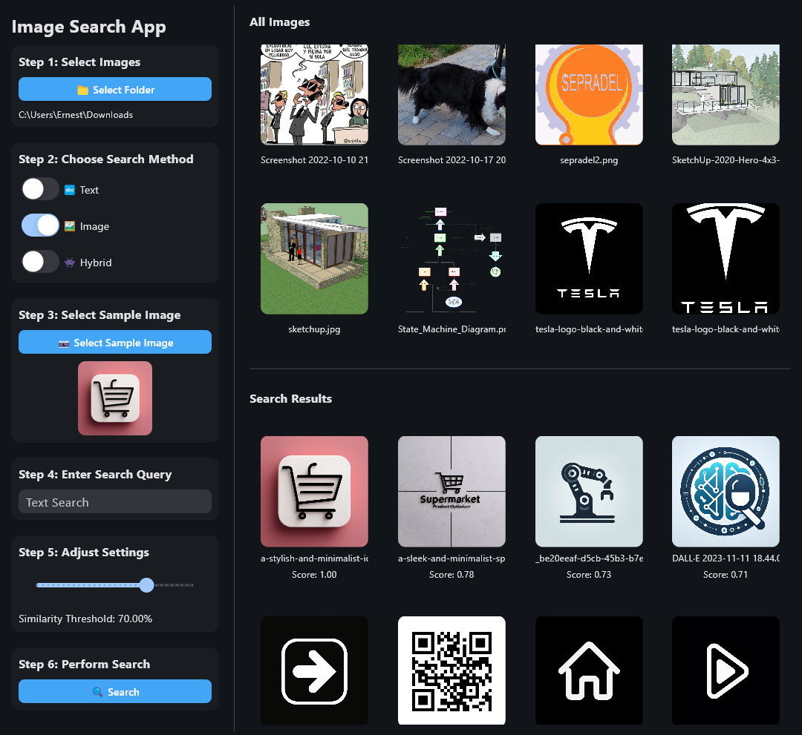

# Python Mini-Projects

This repository hosts various Python mini-programs, each designed to solve specific tasks or demonstrate particular concepts. Currently, it includes one main project:

1. Image Search Engine

## Image Search Engine

The Image Search Engine is a powerful tool that uses CLIP (Contrastive Language-Image Pre-training) to perform image searches based on text descriptions or similar images.

### Features:

- Index images from a selected folder
- Perform text-based image search
- Perform image-based image search
- Hybrid search combining text and image inputs
- Adjustable similarity threshold
- Dark/Light mode toggle
- Display of search results with similarity scores

### Usage:

1. Run the script to open the GUI window
2. Select a folder containing images to index
3. Choose the search method (Text, Image, or Hybrid)
4. Enter a text query or select a sample image (or both for hybrid search)
5. Adjust the similarity threshold if needed
6. Click "Search" to perform the search
7. View results in the main area, with similarity scores displayed

## Requirements

Each project has its own set of requirements. Please refer to the individual project files for specific dependencies.

## License

This project is open-source and available under the MIT License.
