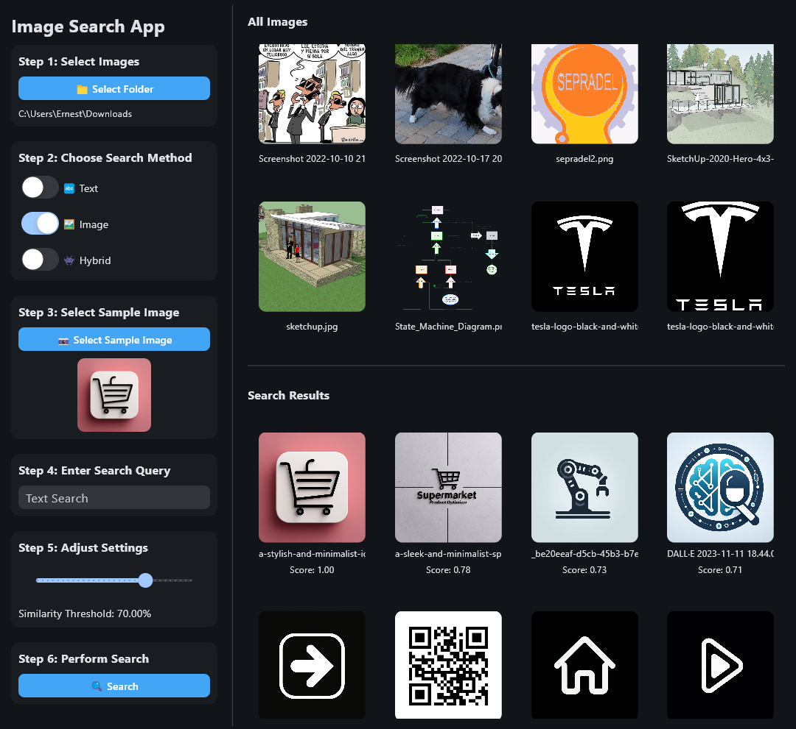

# Python Mini-Projects

This repository hosts various Python mini-programs, each designed to solve specific tasks or demonstrate particular concepts. Currently, it includes two main projects:

1. Code Extractor for LLMs
2. Image Search Engine

## 1. Code Extractor for LLMs

The Code Extractor is a tool designed to help developers easily extract and format their project's code structure and content for use with Large Language Models (LLMs).

### Features:

- Select project type (Generic, Python, Java, C/C++) to apply preset exclusion rules
- Customize folders, file extensions, and specific files to exclude from the scan
- View project structure and file contents
- Navigate through scanned files using a sidebar
- Display statistics (total files scanned and total lines extracted)
- Copy extracted content to clipboard

### Usage:

1. Run the script to open the GUI window
2. Select a project type from the dropdown menu
3. Click "Browse" to select your project folder
4. Modify exclusion fields if needed
5. Click "Scan Project" to start the scanning process
6. Use the sidebar to navigate between files
7. View project structure and file contents in the main text area
8. Check statistics displayed above the "Copy to Clipboard" button
9. Use "Copy to Clipboard" to copy the entire output

## 2. Image Search Engine

The Image Search Engine is a powerful tool that uses CLIP (Contrastive Language-Image Pre-training) to perform image searches based on text descriptions or similar images.

### Features:

- Index images from a selected folder
- Perform text-based image search
- Perform image-based image search
- Hybrid search combining text and image inputs
- Adjustable similarity threshold
- Dark/Light mode toggle
- Display of search results with similarity scores

### Usage:

1. Run the script to open the GUI window
2. Select a folder containing images to index
3. Choose the search method (Text, Image, or Hybrid)
4. Enter a text query or select a sample image (or both for hybrid search)
5. Adjust the similarity threshold if needed
6. Click "Search" to perform the search
7. View results in the main area, with similarity scores displayed

## Requirements

Each project has its own set of requirements. Please refer to the individual project files for specific dependencies.

## License

This project is open-source and available under the MIT License.
